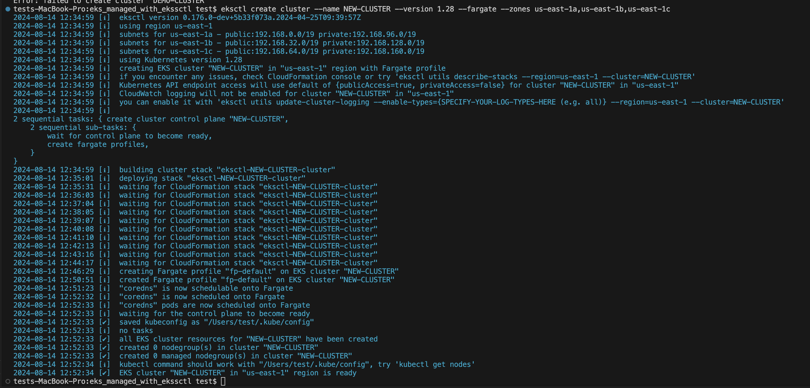
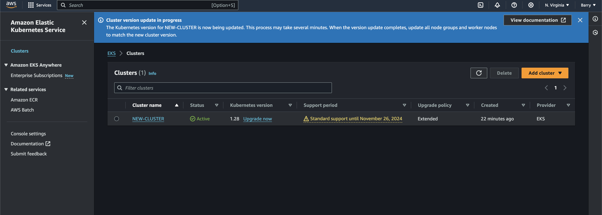
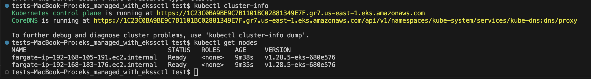
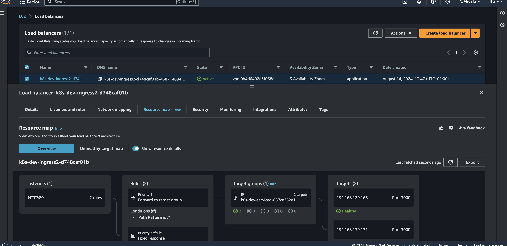

#  Elastic Kubernetes Service Managed With EKSCTL To Deploy A Fargate EKS Cluster

#   Requirements
+   AWS CLI - Command line interface to interract with AWS through API.
+   kubectl - A command line interface to interract with kubernetes cluster.
+   Helm - A package manager for kubernetes.

#   Aim of the Project: The purpose of this project is to deploy an eks fargate cluster and deploy a Frontend Application on it.

#   Procedures
1.  First, we install AWS CLI, so we can have access to AWS through API with the following command:

        #Download the AWS CLI installer
        curl "https://awscli.amazonaws.com/awscli-exe-linux-x86_64.zip" -o "awscliv2.zip"

        #Unzip the installer
        unzip awscliv2.zip

        #Run the installer
        sudo ./aws/install

        #Verify the installation
        aws --version

        #to aunthenticate to aws, we need to run the command and provide the access key and secret key
        aws configure 

2.  Install kubectl tool using the below commands so we can interract with the EKS cluster

        #Download the kubectl binary
        curl -LO "https://dl.k8s.io/release/$(curl -L -s https://dl.k8s.io/release/stable.txt)/bin/linux/amd64/kubectl"

        #Make the binary executable
        chmod +x kubectl

        #Move the binary to a directory in your PATH
        sudo mv kubectl /usr/local/bin/

        #Verify the installation
        kubectl version --client

3.  We can then install eksctl on our machine

        #Download eksctl
        curl -LO "https://github.com/weaveworks/eksctl/releases/latest/download/eksctl_Linux_amd64.tar.gz"

        #Extract the tarball
        tar -xzf eksctl_Linux_amd64.tar.gz

        #Move the binary to a directory in your PATH
        sudo mv eksctl /usr/local/bin/

        #Verify the installation
        eksctl version

4.  Lastly, we proceed to install helm 
        
        #Download the Helm binary
        curl -LO https://get.helm.sh/helm-v3.13.0-linux-amd64.tar.gz

        #Extract the tarball
        tar -xzf helm-v3.13.0-linux-amd64.tar.gz

        #Move the binary to a directory in your PATH
        sudo mv linux-amd64/helm /usr/local/bin/

        #Verify the installation
        helm version

5.  Now that we have the required tools, let's proceed in creating an EKS fargate cluster. We can run the command below to create it using the command below:

        #eksctl create cluster --name YOUR_CLUSTER_NAME --version 1.28 --fargate

        #in my case i used the below command
        eksctl create cluster --name NEW-CLUSTER --version 1.28 --fargate --zones us-east-1a,us-east-1b,us-east-1c

    +   The above command creates the following stack using cloud formation under the hood.
        +   VPC (Virtual Private Cloud) which include public and private subnet in the specified AZ us-east-1a, us-east-1b and us-east-1c
        +   Security Groups: This will be created for the control plane and the worker nodes (even if the nodes are serverless - i.e Fargate)
        +   Internet gateway which route the public subnet to the internet attached to the VPC and also ceates NAT gateway so the the private subnet can get outbound traffic from the internet.
        +   Rote table will be created to ensure the proper routing between the VPC.
        +   IAM Roles for neccessary EKS control plane and Fargate profiles.
        +   EKS control plane where its various componenet are installed which include (etcd, api-server, controller, scheduler and others)
        +   Fargate profile to decide which pods are to run on fargate instead of an ec2 instance.
        +   Cloud formation stack.
        +   Fargate Pod Execution Role in order for the pod running in fargate to be able to pull image from ECR

    +   After, the command run successfully, we should have the below output in our terminal
    
    +   We can also confirm from the AWS UI 
    

    +   Automatically, our kubeconfig is updated to talk to the newly created EKS on AWS. We can run the below command to view if we are connected correctly.

            kubectl cluster-info

            #to check the node being provisioned
            kubectl get nodes
        
    
6.  Now that we can confirm we can interract with the fargate eks cluster, we need to allow the cluster to use AWS Identity and Access Management (IAM) for service accounts with the following command:

        eksctl utils associate-iam-oidc-provider --cluster YOUR_CLUSTER_NAME --approve

        #in my case
        eksctl utils associate-iam-oidc-provider --cluster NEW-CLUSTER --approve

7.  Moving forward, we need to install load balancer controller in our cluser, for that we need to create an IAM policy for the load balancer to make call to AWS API

            #download an IAM policy
            curl -o iam_policy.json https://raw.githubusercontent.com/kubernetes-sigs/aws-load-balancer-controller/v2.6.1/docs/install/iam_policy.json

            #Create an IAM policy with the policy that was downloaded. Use the command:
            aws iam create-policy \
            --policy-name AWSLoadBalancerControllerIAMPolicy \
            --policy-document file://iam_policy.json

8.  Create a service account named aws-load-balancer-controller in the kube-system namespace for the AWS Load Balancer Controller. Use the following command:

            eksctl create iamserviceaccount \    
            --cluster=YOUR_CLUSTER_NAME \  
            --namespace=kube-system \  
            --name=aws-load-balancer-controller \  
            --attach-policy-arn=arn:aws:iam::<AWS_ACCOUNT_ID>:policy/AWSLoadBalancerControllerIAMPolicy \  
            --override-existing-serviceaccounts \  
            --approve

9.  We will be adding AWS load balancer controller using HELM chart with the following command:

            #add the Amazon EKS chart to Helm
            helm repo add eks https://aws.github.io/eks-charts

            #Update the repo to pull the latest chart
            helm repo update eks 

            #Run following command to install the Helm chart . Note: Replace clusterName, region and vpcId with your values:
            helm install aws-load-balancer-controller eks/aws-load-balancer-controller \      
            --set clusterName=YOUR_CLUSTER_NAME \  
            --set serviceAccount.create=false \  
            --set region=YOUR_REGION_CODE \  
            --set vpcId=<VPC_ID> \  
            --set serviceAccount.name=aws-load-balancer-controller \  
            -n kube-system

            #Verify that the controller is installed successfully:
            kubectl get deployment -n kube-system aws-load-balancer-controller 

10. Create a Fargate profile that's required for the application deployment. Use the following command:

            eksctl create fargateprofile --cluster your-cluster --region your-region-code --name alb-sample-app --namespace dev

11. I have a sample application on docker, so i have created a manifest file ay [here](./k8s/deploy.yaml) where i created namespace, deployment, service and an ingress to have a load balancer attached to the service.

            kubectl apply -f deploy.yaml

12. Lastly, i can get the ingress of my application using the command 

            kubectl get ingress -n dev
    
    +   Also, we can see this in AWS
    

13. The deployed application is shown below

14. Finally once we are done we can get to delete the cluster using the command

                eksctl delete cluster --name new-cluster --region region-code

##  Bonus
### I have created a Contineous Integration Pipeline to build and push the application to my dockerhub which is located at the .github/workflows directory.